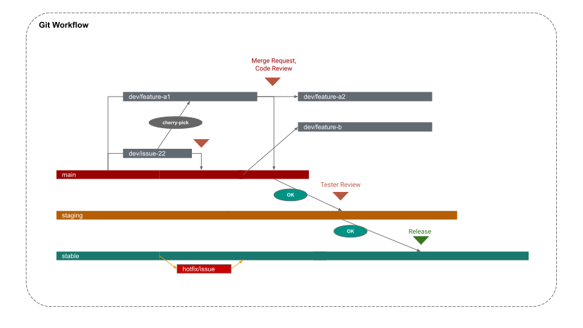

# CODING CONVENTIONS

## 1. Git Conventions

### 1.1. Commit Messages

All commit messages must follow Jira commit format:

```txt
ISSUE-ID: taking actions on somethings

or

ISSUE-ID, ISSUE-ID: taking actions on somethings
```

See more example at
[commitlint-config-jira](https://www.npmjs.com/package/commitlint-config-jira)

### 1.2. Merge Request (MR)

- **Title** must summarize the changes, it must be short and general

```md
Example: "Createuser management" or "Fix product APIs"
```

- **Description** must follow the format below:

```md
## Summary

Fix ISSUE-ID, Fix ISSUE-ID

## How to test?

(What may be affected by this changes)

## Changes

(List of changes)

## Authors

(Who made these changes)
```

### 1.3. Branch Structure



- `main` - development branch
- `staging` - sync to staging server for testing
- `stable` - sync to production server
- `dev/FEATURE-or-ISSUE` - working branch of developers, which is going to be merged into
  `main`
- `hotfix/ISSUE` - urgently fixed issue will be merged into `stable` directly

#### Case Study

- When starting develop a new feature or fix an issue, create a new `dev` branch from
  `main`
- When you working on `dev/feature-a1` and your teammate working on `dev/issue-22`, and
  you need a fix from the teammate branch to continue working on your feature, then you
  should `cherry-pick` the fix commit instead of merging the teammate branch.
- When you done `dev/issue-22`, created a MR for it, and want to start working on
  `feature-b`, you should first back to `main` and create `dev/feature-b` branch from
  `main`.
- Don't create new `dev` branch from previous `dev` branch, except the new `dev` is a part
  of the previous `dev` which cannot be separated.

## 2. Naming Rules

### 2.1. Variables, Function, and Object Properties

- `camelCase`: Use for most of variables and functions name except component name

### 2.2. Files and Folders

- `kebab-case`: Use for folders and files name, except component and hook files

### 2.3. React Components

- `CapitalizedCase`: Use for component name
- `useCapitalizedCase`: Use for React hooks (example: useMutation, useRouter,...)

- Component name structure

```ts
<resource><[action]><ui-element1><ui-element2><ui-element3>
// * <resource> is data resource name, such as User, Product,...
// * <action> is the action on the data (may empty), such as Detail, Create, Update,...
// * <ui-element1> is the name of UI element, such as Dialog, List, Table,...
// * <ui-element2> is the name of child UI element, such as DialogContent, ListItem, TableHeader,...
// * <ui-element3> is the name of child of child UI element, such as DialogContentItem, ListItemAvatar, TableHeaderAction,...

// Example:
UserDetailDialog()
UserDetailDialogContent()
ProductPage()
ProductList()
ProductListItem()
ProductListItemThumbnail()
```

### 2.4. Typescript

- `CapitalizedCase`: Use for type, interface and enum name
- `camelCase`: Use for property name

### 2.5. Constant and Environment variables

- `SCREAMING_SNAKE_CASE`: Use for shared constants like environment variables
- Local constants, like variables in a function, should use `camelCase` instead.

## 3. Common Coding Rules

### 3.1. Variable declaration

- Avoid `var`
- Always use `const` when possible, if not, use `let`

### 3.2. Strict equality operator

- Avoid `==` and `!=`
- Use `===` and `!==`
- Example

```ts
const a = "123";
const b = 123;

a == b; // true    ❌

a === b; // false  ✅
```

### 3.3. Null check

- Avoid `||`
- Use `??`
- Example

```ts
const a = "";

const b = a || "unknown";   ❌
// b -> "unknown"

const c = a ?? "unknown";   ✅
// c -> ""
```

### 3.4. Null Safe

Always pay attention to nullable value

Example

```tsx
// object property, when the property is possibly undefined
const a = data.user.displayName;      ❌
const b = data!.user!.displayName;    ❌
const c = data?.user?.displayName;    ✅

// function call, when the function is possibly undefined
onClickOpen();      ❌
onClickOpen!.();    ❌
onClickOpen?.();    ✅
```

### 3.5. String template literals

For inserting values into strings, use template literals.

Example:

```ts
const a = "Hello";

const b = a + " World!";   ❌

const c = `${a} World!`;   ✅
```

### 3.6. Unknown types

Avoid type `any` or `unknown`.

```tsx
const user : UserResponse;

<UserListItem user={user as any} >         ❌
<UserListItem user={user as unknown} >     ❌
<UserListItem user={user as User} >        ✅
```

### 3.7. Type conversion

Avoid using class constructor like `Number(), Boolean(), String()`

- Example: string to number

```ts
const a = '123';

const b = Number(a);  ❌
const c = +a;         ✅
```

- Example: string, number, object to boolean

```ts
const a = '123';

const b = Boolean(a);  ❌
const c = !!a;         ✅
```

- Example: number to string

```ts
const a = 123;

const b = String(a);        ❌
const c = `${a}`;           ✅
const d = a.toFixed(2);     ✅
const e = a.toString();     ✅
```

### 3.8. Localize string and built-in methods

Benefit built-in method to localize string, process data, avoid external library when
possible.

Example:

```ts
const a = 500000;

const b = a.toLocaleString();
// -> '500,000'

const d = new Date();
const e = a.toLocaleDateString();
// -> '7/26/2023'
```

See more at
[Standard built-in objects](https://developer.mozilla.org/en-US/docs/Web/JavaScript/Reference/Global_Objects)

### 3.9. Values Mapping

Avoid complex condition statement when mapping data values, use mapping object instead.

Example:

```ts
// We have user roles
enum UserRole {
  Admin = "ADMIN",
  Manager = "MANAGER",
  Member = "MEMBER",
}

// ❌ Bad
const color =
  data?.role === "ADMIN"
    ? "red"
    : data?.role === "MANAGER"
    ? "yellow"
    : data?.role === "MEMBER"
    ? "cyan"
    : "grey";

// ❌ Bad
const label =
  data?.role === "ADMIN"
    ? "Administrator"
    : data?.role === "MANAGER"
    ? "Center Manager"
    : data?.role === "MEMBER"
    ? "Center Member"
    : "Unknown";

// ✅ Good, create a mapping object
const UserRoleColor = {
  [UserRole.Admin]: "red",
  [UserRole.Manager]: "yellow",
  [UserRole.Member]: "cyan",
};

const getUserRoleColor = (role: UserRole) => UserRoleColor[role] ?? "grey";

const UserRoleLabel = {
  [UserRole.Admin]: "Administrator",
  [UserRole.Manager]: "Center Manager",
  [UserRole.Member]: "Center Member",
};

const getUserRoleLabel = (role: UserRole) => UserRoleLabel[role] ?? "Unknown";
```

### 3.10. Conditional Values

Use `switch case` to make complex conditional values easy to understand.

Example:

```tsx
// ❌ Bad
<Component
  style={{
    border:
      !showResult && selected
        ? "4px solid #4B4B4B"
        : isCorrect
        ? "4px solid #31BE00"
        : !isCorrect
        ? "4px solid #D33D3C"
        : "none",
  }}
/>;

// ✅ Good
const getBorder = () => {
  switch (true) {
    case !showResult && selected:
      return "4px solid #4B4B4B";
    case showResult && isCorrect:
      return "4px solid #31BE00";
    case showResult && !isCorrect:
      return "4px solid #D33D3C";
    default:
      return "none";
  }
};

<Component
  style={{
    border: getBorder(),
  }}
/>;
```

### 3.11. Multiple values check of one variable

Use array `includes` method to simplify values check

```ts
// ❌ Bad
const isWarning = status === "PENDING" || status === "LIMITATION" || status === "FAILED";

// ✅ Good (but better using enum, see the next section)
const isWarning = ["PENDING", "LIMITATION", "FAILED"].includes(status);
```

### 3.12. Must use enum for known string values

Example

```ts
// ❌ Bad
const isWarning = ["PENDING", "LIMITATION", "FAILED"].includes(status);

// ✅ Good
enum Status {
  Pending = "PENDING",
  Limitation = "LIMITATION",
  Failed = "FAILED",
  Success = "SUCCESS",
}

const isWarning = [Status.Pending, Status.Limitation, Status.Failed].includes(status);
```

### 3.13. Boolean states

Make the boolean statement tidy.

```ts
// ❌ Bad
if (isEmpty || isNewPassDisabled || isConfirmPassDisabled) {
  setDisableBtn(true);
} else {
  setDisableBtn(false);
}

// ✅ Good
setDisableBtn(isEmpty || isNewPassDisabled || isConfirmPassDisabled);
```

### 3.14. Optimal Typing

- Avoid duplicated, unnecessary types.
- Benefit [utility-types](https://www.typescriptlang.org/docs/handbook/utility-types.html)
- Use question mark (?) for optional field.

```ts
interface User {
  // Example we have User object
  id: string;
  name: string;
  tel: string;
  email: string;
  bio?: string;
  jobTitle?: string;
  jobPosition?: string;
}

interface UserCreateDto {
  // ❌ Bad: we have to re-enter all the fields from User above
  name: string;
  tel: string;
  email: string;
  bio?: string;
  jobTitle?: string;
  jobPosition?: string;
}

type UserCreateDto = Omit<User, "id">; // ✅ Good

interface UserUpdateDto {
  // ❌ Bad: we have to re-enter all the fields from User above
  name?: string;
  tel?: string;
  email?: string;
  bio?: string;
  jobTitle?: string;
  jobPosition?: string;
}

type UserUpdateDto = Partial<User>; // ✅ Good

interface UserCourse {
  // ❌ Bad: we have to re-enter all the fields from User
  id: string;
  name: string;
  tel: string;
  email: string;
  bio?: string;
  jobTitle?: string;
  jobPosition?: string;
  course: {
    // ❌ Bad: nested object
    id: string;
    name: string;
  };
  progress: number;
}

interface UserCourse extends User {
  // ✅ Good, use extends
  course: Course; // ✅ Good, defined separated types for nested object
  progress: number;
}
```

## 4. React Coding Rules

### 4.1. Conditional rendering

Make the condition clear and observable

```tsx
data && data.items && <UserList users={data.items} />           ❌
data && data.items ? <UserList users={data.items} /> : null     ❌

!!data?.items?.length && <UserList users={data.items} />    ✅
!data?.items?.length && <UserListEmpty />                     ✅
!data?.items?.length
  ? <UserListEmpty />
  : <UserList users={data.items} />                         ✅
```

### 4.2. React Component Event

When writing a component, event name always starts with `on`

Example:

- `onClick`
- `onOpen`
- `onInputChange`

### 4.3. React Component Event Handler

When using a component, avoid inline handler, ambiguous handler name, alway create a
handler function, handler function name should starts with a verb, such as `handle`,
`set`, `show`, `create`,...

Example:

```tsx
<Button onClick={(e) => setOpen(true)} />      ❌ // inline handler
<Button onClick={handleClick} />               ❌ // ambiguous handler name
<Button onClick={openEditDialog} />            ✅

<Component
  // handler with the same params
  setCheckedAll={(val) => setCheckedAll(val)}   ❌
  onCheckedAll={setCheckedAll}                  ✅

  // handler with fixed params, then the param should be processed inside the handler
  onClick={() => handleRedirect("role")}        ❌
  onClick={handleRedirectRole}                  ✅
/>

items.map(item => (
  <Item
    key={item.id}
    data={item}

    // handler with dynamic params
    onClick={() => showDetail(item)}     ❌
    onClick={showDetail}                    ✅
  />
))

// inside Item component
  const handleClick = () => {
    onClick();                    ❌
    onClick?.(data);              ✅
  }
// inside Item component
```

### 4.4. React Component Props

When necessary, define a type for component props, avoid inline types.

Example:

```tsx
function UserList({ users }: { users: User[] }) {}    ❌

type UserListProps = {
  users: User[],
}

function UserList({ users }: UserListProps) {}    ✅
```

### 4.5. Advanced conditional rendering

When possible, return component result as soon as possible.

Example:

```tsx
// ❌ Bad
function UserPage() {
  // ...

  return (
    <>
      {!!data?.items?.length && <UserList users={data.items} />}
      {!data?.items?.length && <UserListEmpty />}
    </>
  );
}

// ✅ Good
function UserPage() {
  // ...

  if (!data?.items?.length) {
    return <UserListEmpty />;
  }

  return <UserList users={data.items} />;
}
```

### 4.6. Single Responsibility of useEffect

- Each `useEffect` statement should handle one and only one duty
- Prefer primitives in `useEffect` dependencies, **when needed** apply `useMemo` or
  `useCallback` to the dependencies.

Example:

```tsx
// ❌ this 1 useEffect handle 2 effects
useEffect(() => {
  if (errors.newPassword?.message) {
    setNewPassDisabled(true);
  } else {
    setNewPassDisabled(false);
  }

  if (errors.confirmPassword?.message) {
    setConfirmPassDisabled(true);
  } else {
    setConfirmPassDisabled(false);
  }
}, [formState]); // ❌ Not suitable dependencies

// ✅ Good
useEffect(() => {
  setNewPassDisabled(!!errors.newPassword?.message);
}, [errors.newPassword?.message, setNewPassDisabled]);

// ✅ Good
useEffect(() => {
  setConfirmPassDisabled(!!errors.confirmPassword?.message);
}, [errors.confirmPassword?.message, setConfirmPassDisabled]);
```

### 4.7. Reliable UI

The UI should reflect what actually happening in the app.

It means if the app is loading data, the UI should show loading indicator, if an error
occurred it should show an error message...

Example:

```tsx
// ❌ Bad: Missing error check and empty data check.

const { data, loading } = useAPIData();

if (loading) return <Loading />;

return <Component data={data} />;

// ✅ Good: Check all possible states

const { data, loading, error } = useAPIData();

if (loading) return <Loading />;

if (error) return <ErrorNotice error={error} />;

if (!data?.items?.length) return <EmptyNotice />;

return <Component data={data?.items} />;
```

### 4.8. Define variables outside of component

Whenever possible, define variables outside of component

Example:

```tsx
// ❌ Bad
function Component() {
  //...
  const columns = ["Name", "Title", "Role"];
  //...
}

// ✅ Good
const columns = ["Name", "Title", "Role"];

function Component() {
  //...
}
```

### 4.9. Define helper function outside of component

A helper function which help processing some data but not directly depend on component
states, should be defined outside of component.

Example:

```tsx
// ❌ Bad
function Component() {
  //...
  const formatDate = (date: string) => {
    return new Date(date).toLocaleDateString();
  };
  //...
}

// ✅ Good, the function should be defined in a separated file in `src/utils`
const formatDate = (date: string) => {
  return new Date(date).toLocaleDateString();
};

function Component() {
  //...
}
```
